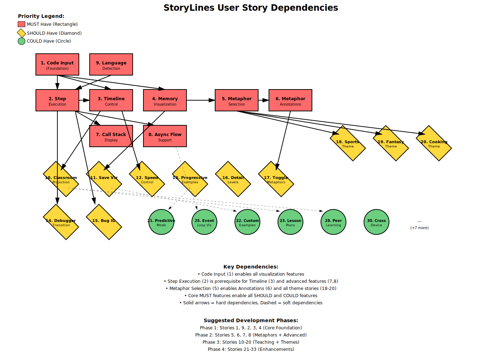

# StoryLines User Story Backlog

## MUST Have (Core Functionality)

### 1. Code Input

**As a** user
**I need** to paste or type my code into the application
**So that** I can analyze my specific problems

**Acceptance Criteria:**

- Support JavaScript code input
- Syntax validation
- Error feedback for invalid code

---

### 2. Step Execution

**As a** learner
**I need** to see my code execute step-by-step
**So that** I understand what happens at each line

**Acceptance Criteria:**

- Show current executing line
- Display execution order
- Highlight active code

---

### 3. Timeline Control

**As a** user
**I need** playback controls to move through execution
**So that** I can review at my own pace

**Acceptance Criteria:**

- Play/pause functionality
- Step forward/backward
- Scrubber for jumping to specific points
- Step counter display

---

### 4. Memory Visualization

**As a** student
**I need** to see how variables and memory change
**So that** I understand data flow

**Acceptance Criteria:**

- Show all variables in scope
- Display current values
- Highlight value changes
- Support arrays and objects

---

### 5. Metaphor Selection

**As a** user
**I need** to choose from different metaphor themes
**So that** I can select explanations that resonate with me

**Acceptance Criteria:**

- At least 3 metaphor themes
- Easy theme switching
- Preview of metaphor style
- Persist selection

---

### 6. Metaphor Annotations

**As a** learner
**I need** metaphorical explanations inline with code
**So that** abstract concepts become concrete

**Acceptance Criteria:**

- Context-aware metaphors
- Inline comments/tooltips
- Consistent theme throughout
- Clear mapping to code behavior

---

### 7. Call Stack Display

**As a** user learning recursion
**I need** to see the call stack build and unwind
**So that** I understand recursive execution

**Acceptance Criteria:**

- Visual stack representation
- Show function calls and returns
- Display stack depth
- Highlight active frame

---

### 8. Async Flow Support

**As a** developer
**I need** to visualize async/await and promises
**So that** I understand asynchronous timing

**Acceptance Criteria:**

- Show async pauses
- Display promise states
- Visualize event loop
- Support generators

---

### 9. Language Detection

**As a** user
**I need** automatic detection of code patterns
**So that** relevant visualizations are applied

**Acceptance Criteria:**

- Detect recursion
- Identify async patterns
- Recognize loops
- Find common algorithms

---

## SHOULD Have (Important Enhancements)

### 10. Classroom Projection

**As a** teacher
**I need** to display visualizations on a smartboard
**So that** I can teach interactively

**Acceptance Criteria:**

- Full-screen mode
- Large, readable fonts
- Presenter controls
- Student follow-along mode

---

### 11. Save Visualizations

**As a** user
**I need** to save and export my learning sessions
**So that** I can review later

**Acceptance Criteria:**

- Save state/bookmarks
- Export as image/video
- Shareable links
- Session history

---

### 12. Speed Control

**As a** learner
**I need** adjustable playback speed
**So that** I can match my learning pace

**Acceptance Criteria:**

- Variable speed slider
- Slow motion for complex parts
- Quick skip for understood sections
- Pause on key moments

---

### 13. Progressive Examples

**As a** beginner
**I need** to start with simple examples
**So that** I can build understanding incrementally

**Acceptance Criteria:**

- Example library
- Difficulty progression
- Related example suggestions
- Custom starting points

---

### 14. Debugger Transition

**As a** student
**I need** guidance on using professional debuggers
**So that** I can apply my learning to real tools

**Acceptance Criteria:**

- Compare visualizations to debugger output
- Tutorial on debugger features
- Side-by-side view option
- Export to debugger format

---

### 15. Bug Identification

**As a** developer
**I need** help identifying why code fails
**So that** I can fix bugs effectively

**Acceptance Criteria:**

- Highlight unexpected behavior
- Compare expected vs actual
- Suggest common fixes
- Error pattern recognition

---

### 16. Detail Levels

**As a** teacher
**I need** configurable visualization detail
**So that** I can adapt to student skill levels

**Acceptance Criteria:**

- Beginner/intermediate/advanced modes
- Toggle specific features
- Customizable complexity
- Save configurations

---

### 17. Toggle Metaphors

**As a** user
**I need** to turn metaphors on/off
**So that** I can see plain code when ready

**Acceptance Criteria:**

- Quick toggle switch
- Gradual fade option
- Remember preference
- Partial metaphor mode

---

### 18. Sports Theme

**As a** user with athletic background
**I need** sports/competition metaphors
**So that** timing and coordination concepts click

**Acceptance Criteria:**

- Relay race for async
- Game strategy patterns
- Tournament brackets
- Team coordination metaphors

---

### 19. Fantasy Theme

**As a** user who enjoys narratives
**I need** fantasy/adventure metaphors
**So that** code becomes a magical story

**Acceptance Criteria:**

- Spell casting for functions
- Quest progression for execution
- Magical items for variables
- Gremlin character consistency

---

### 20. Cooking Theme

**As a** user
**I need** cooking/recipe metaphors
**So that** delegation and process concepts are familiar

**Acceptance Criteria:**

- Recipe steps for algorithms
- Chef hierarchy for calls
- Ingredient preparation for setup
- Kitchen workflow for execution

---

## COULD Have (Nice Additions)

### 21. Predictive Mode

**As a** learner
**I need** to predict execution before seeing it
**So that** I can test my understanding

**Acceptance Criteria:**

- Prediction input interface
- Compare prediction to actual
- Score/feedback system
- Learning tracking

---

### 22. Custom Examples

**As a** user
**I need** to create my own annotated examples
**So that** I can build a personal reference

**Acceptance Criteria:**

- Example editor
- Custom metaphor annotations
- Save to library
- Share with others

---

### 23. Lesson Plans

**As a** teacher
**I need** structured lesson integration
**So that** classroom use is organized

**Acceptance Criteria:**

- Lesson templates
- Time-based sections
- Student exercises
- Assessment tools

---

### 24. Related Concepts

**As a** learner
**I need** suggestions for what to learn next
**So that** my learning path is clear

**Acceptance Criteria:**

- Concept graph
- Prerequisite tracking
- Next step suggestions
- Skill progression map

---

### 25. Event Loop Viz

**As a** developer
**I need** to see the JavaScript event loop
**So that** I understand async coordination

**Acceptance Criteria:**

- Queue visualization
- Microtask vs macrotask
- Execution order display
- Interactive exploration

---

### 26. Heap Visualization

**As a** user
**I need** to see memory heap and references
**So that** I understand object relationships

**Acceptance Criteria:**

- Object graph display
- Reference counting
- Garbage collection hints
- Memory usage tracking

---

### 27. Promise Timing

**As a** developer
**I need** to see promise resolution timing
**So that** I understand async coordination

**Acceptance Criteria:**

- Promise chain visualization
- Resolution timeline
- Error propagation
- State transitions

---

### 28. Peer Learning

**As a** teacher
**I need** features for student collaboration
**So that** peer teaching is facilitated

**Acceptance Criteria:**

- Shared sessions
- Student annotations
- Discussion threads
- Help requests

---

### 29. Community Sharing

**As a** user
**I need** to access community examples
**So that** I can learn from others

**Acceptance Criteria:**

- Public example library
- Rating/voting system
- Comments and discussions
- Verified solutions

---

### 30. Cross-Device

**As a** user
**I need** to use StoryLines on any device
**So that** I can learn anywhere

**Acceptance Criteria:**

- Responsive design
- Touch controls
- Mobile optimization
- Sync across devices

---

### 31. Offline Mode

**As a** user with unreliable internet
**I need** offline functionality
**So that** I can learn without connection

**Acceptance Criteria:**

- Local storage
- Offline example library
- Sync when connected
- Download for offline

---

### 32. Large Code Support

**As a** developer
**I need** to analyze production-size code
**So that** real problems can be debugged

**Acceptance Criteria:**

- Performance optimization
- Code folding
- Section focusing
- Memory management

---

### 33. Annotation Tools

**As a** learner
**I need** to add my own notes and drawings
**So that** I can personalize my learning

**Acceptance Criteria:**

- Drawing tools
- Text annotations
- Highlight important parts
- Save annotations

---

## Priority Rationale

### MUST Have (MVP)

These features form the minimum viable product that delivers core value:

- Basic code execution visualization
- Metaphor system for mental models
- Essential controls for learning pace
- Support for key JavaScript patterns

### SHOULD Have (Full Product)

These features significantly enhance the learning experience:

- Classroom and teaching support
- Multiple metaphor themes
- Advanced configuration options
- Bridge to professional tools

### COULD Have (Future Enhancements)

These features would be valuable additions but aren't essential:

- Advanced visualizations
- Community features
- Quality of life improvements
- Extended platform support
