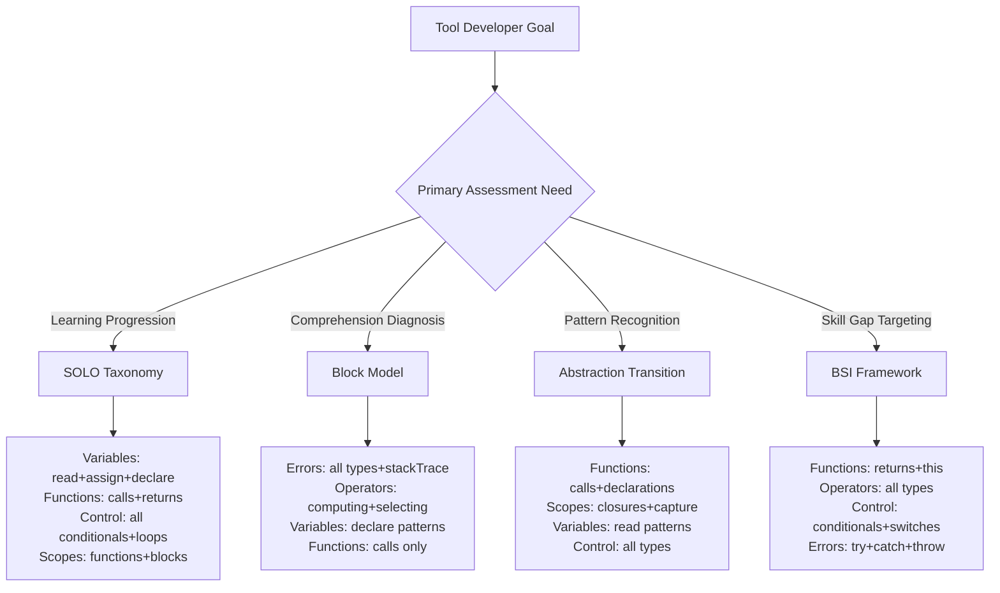
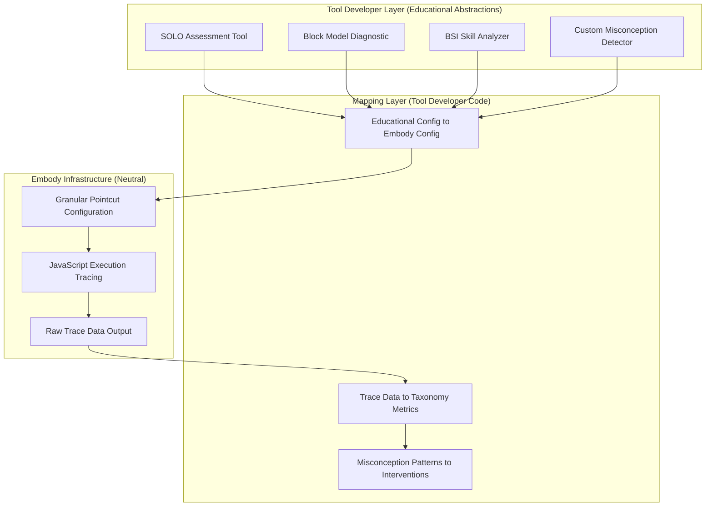

# Tool Developer Taxonomy Guide: Granular JavaScript Instrumentation Specifications

**Phase 3.B***: Practitioner-facing guidelines (trading zone)

**Purpose:** Enable tool developers to implement any of four taxonomies (SOLO, Block Model, Abstraction Transition, BSI) using Embody's comprehensive trace data infrastructure.

**Core Principle:**

- **"What They Do"**: Tool developers choose taxonomies and build misconception detection tools
- **"What We Do"**: Provide comprehensive, granular, configurable JavaScript execution trace data

---

## 1. Executive Summary for Tool Developers

### Taxonomy Selection → Configuration Mapping



### Granular Data Requirements by Taxonomy

| Taxonomy                   | Required Config Fields                                                                                  | Essential Pointcut Data                                                               | Performance Overhead                          | Implementation Priority                         |
| -------------------------- | ------------------------------------------------------------------------------------------------------- | ------------------------------------------------------------------------------------- | --------------------------------------------- | ----------------------------------------------- |
| **SOLO**                   | `variables: {read,assign,declare}`, `functions: {calls,returns}`, `controlFlow: {conditionals,loops}`   | Variable state progression, function composition patterns, task completion sequences  | Medium (requires extensive variable tracking) | **High Impact** - enables adaptive learning     |
| **Block Model**            | `errors: {all types + stackTrace}`, `operators: {computing,selecting}`, `variables: {declare patterns}` | Error classification data, syntax vs semantic patterns, execution prediction accuracy | Low (error-driven collection)                 | **High Impact** - enables diagnostic assessment |
| **Abstraction Transition** | `functions: {calls,declarations}`, `scopes: {closures}`, `variables: {read patterns}`                   | Pattern usage context, abstraction level indicators, generalization attempts          | High (complex pattern analysis)               | **Medium Impact** - advanced feature            |
| **BSI**                    | `functions: {returns,this}`, `operators: {all}`, `controlFlow: {conditionals,switches}`                 | Behavior prediction accuracy, strategy appropriateness, implementation quality        | Medium (execution-focused)                    | **High Impact** - enables targeted practice     |

---

## 2. Granular Instrumentation Specifications

### SOLO Taxonomy Implementation Requirements

**Required Configuration** (using actual `config/types.ts`):

```typescript
{
  variables: {
    declare: { var: true, let: true, const: true, function: true, implicit: true },
    assign: true,
    read: true,
    filter: [] // Track all variables for progression analysis
  },
  functions: {
    calls: true,
    declarations: true,
    returns: true,
    this: false, // Not critical for SOLO analysis
    yield: true,
    filter: [] // Track all functions for composition analysis
  },
  controlFlow: {
    conditionals: true,
    loops: true,
    switches: true,
    breaks: true,
    filter: []
  },
  scopes: {
    global: true,
    functions: true,
    blocks: true,
    modules: false, // Optional for SOLO
    closures: { creation: false, capture: false, access: false } // Not essential
  }
}
```

**Pointcut Data Format for SOLO Level Detection**:

**Variable Declaration (`declare@after`)**:

```json
{
  "pointcut": "declare@after",
  "timestamp": 1234567890,
  "sequence": 42,
  "scope_id": "scope_123",
  "variable_name": "userInput",
  "declaration_type": "let",
  "initial_value": { "type": "undefined", "serialized": "undefined" },
  "scope_level": "function",
  "is_parameter": false
}
```

**Function Call (`apply@around`)**:

```json
{
  "pointcut": "apply@around",
  "timestamp": 1234567891,
  "sequence": 43,
  "function_name": "validateInput",
  "function_type": "declaration",
  "arguments": [{ "type": "string", "value": "test@email.com" }],
  "call_context": "direct",
  "composition_depth": 2,
  "is_recursive": false
}
```

**SOLO Level Detection Algorithm**:

- **Prestructural**: No successful task completion, high error rate (>50% failed executions)
- **Unistructural**: Single function success, no variable integration between functions
- **Multistructural**: Multiple functions work separately, no data flow between them
- **Relational**: Complex data flow patterns, function composition depth >2
- **Extended Abstract**: Novel function patterns, cross-context variable usage

### Block Model Implementation Requirements

**Required Configuration**:

```typescript
{
  errors: {
    try: true,
    throw: true,
    catch: true,
    finally: true,
    unhandled: true,
    stackTrace: true // Critical for comprehension level detection
  },
  operators: {
    computing: true, // Arithmetic, logical operations
    selecting: true, // Property access, array indexing
    mutating: false // Not essential for Block Model
  },
  variables: {
    declare: { var: true, let: true, const: true },
    assign: false, // Focus on declaration patterns
    read: false
  },
  functions: {
    calls: true,
    declarations: false,
    returns: false
  }
}
```

**Pointcut Data Format for Comprehension Level Detection**:

**Error Occurrence (`error@after`)**:

```json
{
  "pointcut": "error@after",
  "timestamp": 1234567892,
  "sequence": 44,
  "error_type": "ReferenceError",
  "error_message": "Cannot access 'x' before initialization",
  "error_location": { "line": 5, "column": 12 },
  "stack_trace": ["main:5:12", "setup:2:4"],
  "comprehension_level_indicator": "text_surface", // vs "program_model" vs "situation_model"
  "syntax_attempted": "let_declaration_usage"
}
```

**Operator Usage (`compute@after`)**:

```json
{
  "pointcut": "compute@after",
  "timestamp": 1234567893,
  "sequence": 45,
  "operator": "+",
  "operands": [
    { "type": "number", "value": 5 },
    { "type": "string", "value": "test" }
  ],
  "result": { "type": "string", "value": "5test" },
  "type_coercion_occurred": true,
  "comprehension_level": "program_model" // understands execution but not type system
}
```

**Block Model Level Classification**:

- **Text Surface**: Syntax errors, keyword misuse, operator precedence issues
- **Program Model**: Logic errors, control flow mistakes, variable scoping confusion
- **Situation Model**: Domain mapping errors, inappropriate algorithm choice

### Abstraction Transition Implementation Requirements

**Required Configuration**:

```typescript
{
  functions: {
    calls: true,
    declarations: true,
    returns: false,
    filter: [] // Pattern recognition requires all function usage
  },
  scopes: {
    closures: {
      creation: true, // Track closure creation patterns
      capture: true,  // Track variable capture
      access: true    // Track closure variable access
    },
    functions: true,
    blocks: true
  },
  variables: {
    read: true, // Pattern usage analysis
    assign: false,
    declare: false
  }
}
```

**Pointcut Data Format for Abstraction Level Assessment**:

**Function Usage Pattern (`apply@before`)**:

```json
{
  "pointcut": "apply@before",
  "timestamp": 1234567894,
  "sequence": 46,
  "function_name": "map",
  "usage_context": "array_method",
  "pattern_type": "builtin_higher_order",
  "abstraction_level": "concrete", // vs "transitional" vs "abstract"
  "generalization_indicators": {
    "novel_usage": false,
    "cross_context_application": false,
    "pattern_modification": false
  }
}
```

**Closure Creation (`closure@creation`)**:

```json
{
  "pointcut": "closure@creation",
  "timestamp": 1234567895,
  "sequence": 47,
  "captured_variables": ["multiplier", "baseValue"],
  "capture_context": "function_factory",
  "abstraction_attempt": "parametric_behavior",
  "pattern_sophistication": "intermediate"
}
```

**Abstraction Level Classification**:

- **Concrete**: Uses provided patterns without modification
- **Transitional**: Modifies patterns for similar contexts
- **Abstract**: Creates novel patterns, generalizes across domains

### BSI Taxonomy Implementation Requirements

**Required Configuration**:

```typescript
{
  functions: {
    calls: false,
    returns: true, // Behavior prediction assessment
    this: true,    // Strategy understanding
    declarations: false
  },
  operators: {
    computing: true,
    selecting: true,
    mutating: true // Implementation quality assessment
  },
  controlFlow: {
    conditionals: true,
    loops: false, // Less critical for BSI
    switches: true,
    breaks: false
  },
  errors: {
    try: true,
    catch: true,
    throw: true // Implementation quality indicator
  }
}
```

**Pointcut Data Format for BSI Assessment**:

**Function Return Analysis (`return@after`)**:

```json
{
  "pointcut": "return@after",
  "timestamp": 1234567896,
  "sequence": 48,
  "return_value": { "type": "number", "value": 42 },
  "function_name": "calculateTotal",
  "expected_behavior": "sum_calculation",
  "behavior_correctness": true,
  "implementation_quality": "good", // based on approach efficiency
  "strategy_appropriateness": "optimal" // for given problem context
}
```

**This Binding Context (`this@binding`)**:

```json
{
  "pointcut": "this@binding",
  "timestamp": 1234567897,
  "sequence": 49,
  "this_value": { "type": "object", "constructor": "Calculator" },
  "binding_context": "method_call",
  "strategy_understanding": "object_oriented",
  "implementation_correctness": true
}
```

**BSI Level Assessment**:

- **Behavior**: Can predict what code will do (return value accuracy)
- **Strategy**: Chooses appropriate approach (this binding, control flow selection)
- **Implementation**: Writes syntactically and semantically correct code

---

## 3. Summary: Responsibilities and Success Metrics

### Tool Developer Responsibilities

**Educational Innovation ("What They Do")**:

1. **Choose taxonomies** based on educational goals and research
2. **Map educational concepts** to Embody's granular configuration options
3. **Build interpretation logic** to convert trace data into educational insights
4. **Create user interfaces** with pedagogical abstractions and concepts
5. **Implement intervention strategies** based on misconception detection
6. **Validate educational effectiveness** of their taxonomy implementations

**Technical Implementation**:

- Start with single taxonomy for fastest time-to-value
- Use Embody's actual `config/types.ts` schema for configuration
- Build performance monitoring into educational tools
- Design data processing pipelines for real-time or batch analysis
- Plan for multi-taxonomy correlation if educationally valuable

**Success Metrics for Tool Developers**:

- Educational effectiveness: Measurable learning improvement
- User adoption: Teacher and student engagement with tool
- Technical performance: <20% overhead in classroom deployment
- Implementation speed: Basic misconception detection in <2 weeks

### Embody Infrastructure Responsibilities

**Neutral Data Infrastructure ("What We Do")**:

1. **Provide granular trace data** via `trace(code, config) → TraceEvent[]`
2. **Support flexible configuration** through pointcut-level control
3. **Ensure reliable instrumentation** across JavaScript language features
4. **Maintain performance** with configurable sampling and filtering
5. **Deliver consistent data formats** for tool developer consumption
6. **Enable innovation** through comprehensive, neutral trace capabilities

**Technical Priorities for Embody**:

**Core Infrastructure** (enables all educational innovation):

- Robust variable/function/error/scope tracking with granular filtering
- Reliable pointcut instrumentation across all JavaScript constructs
- Consistent trace data formats with comprehensive documentation
- Performance optimization and overhead monitoring capabilities

**Advanced Capabilities** (enables sophisticated analysis):

- Closure creation/capture/access tracking for advanced pattern analysis
- Operator instrumentation for type coercion and computation tracking
- Sampling strategies for high-frequency events
- Memory management for large-scale classroom deployment

**Success Metrics for Embody**:

- Technical reliability: Consistent trace data across all JavaScript features
- Performance: Configurable overhead from <5% (minimal) to <25% (comprehensive)
- Adoption: Multiple educational tools built successfully on infrastructure
- Innovation enablement: Tool developers can implement novel taxonomies

### The Boundary: What Embody Does NOT Do

**Educational Abstractions** (Tool Developer Territory):

- ❌ "SOLO assessment modes" or "Block Model diagnostics"
- ❌ Taxonomy-specific configuration presets or educational interfaces
- ❌ Misconception detection algorithms or intervention recommendations
- ❌ Learning progression tracking or educational outcome measurement
- ❌ Pedagogical user interfaces or assessment scoring systems

**Neutral Infrastructure** (Embody Territory):

- ✅ Granular JavaScript execution tracing based on pointcut configuration
- ✅ Reliable data collection with filtering and sampling options
- ✅ Performance optimization and memory management
- ✅ Comprehensive trace data formats for tool developer consumption
- ✅ Language feature support and instrumentation reliability

---

## 4. Performance and Optimization Guidelines

### Instrumentation Overhead Analysis

**High Overhead Operations** (use selectively):

- `scopes.closures.access: true` - Every closure variable access tracked
- `variables.read: true` with no filtering - Every variable read logged
- `functions.calls: true` with no filtering in recursive code

**Medium Overhead Operations** (standard usage):

- `controlFlow` operations - Conditional and loop tracking
- `functions.returns: true` - Return value serialization
- `operators.computing: true` - Arithmetic operation logging

**Low Overhead Operations** (minimal impact):

- `variables.declare: true` - Variable declarations only
- `errors.*: true` - Error-driven collection
- `functions.declarations: true` - Function definition tracking

### Memory Management Considerations

**Trace Size Limits**:

- **Development**: Unlimited for comprehensive analysis
- **Classroom**: 10MB per student session
- **Assessment**: 1MB per task

**Streaming Options**:

```typescript
{
  trace_management: {
    max_events: 100000,
    streaming_threshold: 50000,
    compression: "gzip",
    auto_flush: true
  }
}
```

**Level 1 - Assessment Enhanced:**

```javascript
"assessment_data": {
  "output_predictions": true,    // Enables: Block Model, BSI Behavior
  "code_reading_tasks": true,    // Enables: Block Model, SOLO
  "execution_tracing": true      // Enables: Block Model, Abstraction Transition
}
```

**Level 2 - Advanced Analytics:**

```javascript
"advanced_data": {
  "transfer_exercises": true,     // Enables: SOLO Extended Abstract, Abstraction Transition
  "pattern_recognition": true,    // Enables: Abstraction Transition
  "approach_explanations": true,  // Enables: BSI Strategy, SOLO reasoning
  "metacognitive_capture": true   // Enables: SOLO Extended Abstract
}
```

### Data Overlap Optimization

**High-Value Overlaps (collect once, use multiple ways):**

- **Error patterns** → SOLO (progression), Block Model (classification), BSI (targeting)
- **Task performance** → SOLO (sophistication), Abstraction Transition (transfer), BSI (competency)
- **Code quality metrics** → SOLO (complexity), BSI (implementation), Block Model (surface level)

**Taxonomy-Specific Requirements:**

- **SOLO only:** Metacognitive artifacts, transfer task performance
- **Block Model only:** Syntax vs semantic error distinction
- **Abstraction Transition only:** Cross-domain pattern recognition
- **BSI only:** Approach rationale capture

---

## 5. Data Processing Pipelines

### Raw Trace → Taxonomy Inference Examples

**SOLO Level Detection Pipeline**:

```typescript
function detectSOLOLevel(traceEvents: TraceEvent[]): SOLOLevel {
  const metrics = {
    functionCompositionDepth: calculateMaxCompositionDepth(traceEvents),
    variableIntegration: analyzeDataFlowBetweenFunctions(traceEvents),
    taskCompletionSuccess: calculateSuccessRate(traceEvents),
    novelPatternCreation: detectNovelPatterns(traceEvents)
  };

  if (metrics.taskCompletionSuccess < 0.5) return 'prestructural';
  if (metrics.functionCompositionDepth === 1) return 'unistructural';
  if (metrics.variableIntegration < 2) return 'multistructural';
  if (metrics.novelPatternCreation > 0) return 'extended_abstract';
  return 'relational';
}
```

**Block Model Comprehension Classification**:

```typescript
function classifyComprehensionBreakdown(errorEvents: ErrorEvent[]): ComprehensionLevel {
  const errorTypes = categorizeErrors(errorEvents);

  if (errorTypes.syntax > 0.7) return 'text_surface';
  if (errorTypes.logic > 0.5) return 'program_model';
  if (errorTypes.domain > 0.3) return 'situation_model';
  return 'comprehensive'; // No significant error patterns
}
```

### Real-Time vs Batch Processing Strategies

**Real-Time Processing** (for immediate feedback):

- Error pattern detection: <100ms response time
- Basic SOLO level estimation: <500ms response time
- BSI behavior assessment: <200ms response time

**Batch Processing** (for comprehensive analysis):

- Abstraction transition detection: Complex pattern analysis
- Longitudinal SOLO progression: Multi-session data integration
- Cross-taxonomy correlation analysis: Statistical pattern discovery

### Tool Developer Implementation Phases

**Phase 1: Basic Embody Integration (Week 1-2)**

_Tool Developer Capabilities_: Error pattern analysis, simple progress tracking

_Raw Embody Configuration_:

```typescript
// Minimal viable configuration for educational tool development
const basicConfig: Config = {
  errors: {
    try: true,
    catch: true,
    throw: true,
    unhandled: true,
    stackTrace: true
  },
  variables: {
    declare: true,
    assign: false, // Reduce overhead initially
    read: false
  },
  functions: {
    calls: true,
    declarations: false,
    returns: false
  }
};
```

_Implementation Effort_: Low - Tool developers can build basic misconception detection

**Phase 2: Comprehensive Tracking (Week 3-4)**

_Tool Developer Capabilities_: Learning progression tracking, diagnostic assessment

_Raw Embody Configuration_:

```typescript
// Standard configuration for comprehensive educational analysis
const standardConfig: Config = {
  variables: {
    declare: true,
    assign: true,
    read: true,
    filter: [] // Tool developers may choose specific variables
  },
  functions: {
    calls: true,
    declarations: true,
    returns: true
  },
  controlFlow: {
    conditionals: true,
    loops: true,
    switches: true
  },
  errors: {
    try: true,
    catch: true,
    throw: true,
    unhandled: true,
    stackTrace: true
  }
};
```

_Implementation Effort_: Medium - Tool developers can implement full taxonomy analysis

**Phase 3: Advanced Pattern Analysis (Week 5+)**

_Tool Developer Capabilities_: Cross-domain transfer assessment, advanced misconception prediction

_Raw Embody Configuration_:

```typescript
// Comprehensive configuration for advanced educational research
const advancedConfig: Config = {
  variables: { declare: true, assign: true, read: true },
  functions: { calls: true, declarations: true, returns: true, this: true, yield: true },
  controlFlow: { conditionals: true, loops: true, switches: true, breaks: true },
  operators: { computing: true, selecting: true, mutating: true },
  scopes: {
    global: true,
    functions: true,
    blocks: true,
    closures: { creation: true, capture: true, access: true }
  },
  errors: { try: true, catch: true, throw: true, finally: true, unhandled: true, stackTrace: true }
};
```

_Implementation Effort_: High - Tool developers can implement novel educational approaches

---

## 6. JavaScript-Specific Implementation Examples

### Async Programming Misconception Detection

**Tool Developer Use Case**: Building a tool to detect and address async/await misconceptions

**Raw Embody Configuration for Async Analysis**:

```typescript
const asyncMisconceptionConfig: Config = {
  functions: {
    calls: true, // Track Promise creation and async function calls
    returns: true, // Track async function returns
    yield: true // Track await expressions
  },
  controlFlow: {
    conditionals: true, // Error handling patterns in async code
    loops: false // Less relevant for async analysis
  },
  errors: {
    try: true,
    catch: true,
    throw: true,
    unhandled: true, // Critical for Promise rejection tracking
    stackTrace: true
  },
  variables: {
    assign: true, // Track Promise variable assignments
    read: false // Reduce overhead, focus on assignment patterns
  }
};
```

**Expected Trace Patterns for Tool Developer Analysis**:

```typescript
// Tool developer processes this trace data to detect misconceptions
const asyncMisconceptionPattern = {
  // Common misconception: Treating async functions as synchronous
  traceSignature: [
    { pointcut: 'apply@around', function_name: 'fetchData' },
    { pointcut: 'read@after', variable_name: 'result' }, // Immediate read attempt
    { pointcut: 'error@after', error_type: 'TypeError' } // "Cannot read property of undefined"
  ],
  // Tool developer's educational interpretation:
  misconceptionType: 'synchronous_assumption',
  interventionSuggestion: 'explain_promise_resolution_timing'
};
```

### Closure Comprehension Assessment

**Tool Developer Use Case**: Assessing closure understanding progression for pattern recognition training

**Raw Embody Configuration for Closure Analysis**:

```typescript
const closureAssessmentConfig: Config = {
  scopes: {
    functions: true,
    blocks: true,
    closures: {
      creation: true, // Track when closures are created
      capture: true, // Track variable capture patterns
      access: true // Track closure variable access
    }
  },
  variables: {
    declare: true, // Track closure parameter declarations
    assign: false,
    read: true, // Track captured variable reads
    filter: [] // Analyze all variables for closure patterns
  },
  functions: {
    calls: true, // Track closure invocations
    declarations: true, // Track closure creation
    returns: true // Track returned closures
  }
};
```

**Tool Developer Abstraction Level Detection**:

```typescript
function detectClosureAbstractionLevel(traces: TraceEvent[]): AbstractionLevel {
  const closureEvents = traces.filter(e => e.pointcut.includes('closure'));
  const patterns = {
    usesProvidedClosures: hasClosureUsage(closureEvents),
    modifiesClosurePatterns: hasClosureModification(closureEvents),
    createsNovelClosures: hasNovelClosureCreation(closureEvents),
    generalizesAcrossContexts: hasGeneralization(closureEvents)
  };

  // Tool developer's educational logic (not Embody's responsibility):
  if (!patterns.usesProvidedClosures) return 'pre_concrete';
  if (patterns.usesProvidedClosures && !patterns.modifiesClosurePatterns) return 'concrete';
  if (patterns.modifiesClosurePatterns && !patterns.createsNovelClosures) return 'transitional';
  if (patterns.createsNovelClosures || patterns.generalizesAcrossContexts) return 'abstract';

  return 'transitional';
}
```

### Type Coercion Misconception Detection

**Tool Developer Use Case**: Understanding JavaScript type system misconceptions

**Raw Embody Configuration for Type Analysis**:

```typescript
const typeCoercionConfig: Config = {
  operators: {
    computing: true, // Track arithmetic operations with mixed types
    selecting: true, // Track property access that might trigger coercion
    mutating: false // Less relevant for type understanding
  },
  variables: {
    declare: true, // Track variable type declarations/inferences
    assign: true, // Track type changes through assignment
    read: false // Reduce overhead
  },
  functions: {
    calls: true, // Track type conversion function calls
    returns: true // Track return type patterns
  },
  errors: {
    unhandled: true, // Type-related runtime errors
    stackTrace: false // Not needed for type analysis
  }
};
```

**Tool Developer Misconception Pattern Recognition**:

```typescript
const typeCoercionPatterns = {
  // Tool developer defines educational patterns based on trace data
  stringNumberCoercion: {
    traceSignature: [
      {
        pointcut: 'compute@before',
        operator: '+',
        operands: [{ type: 'string' }, { type: 'number' }]
      },
      { pointcut: 'compute@after', result: { type: 'string' } }
    ],
    // Tool developer's educational interpretation:
    expectedMisconception: 'assumes_numeric_addition',
    correctUnderstanding: 'string_concatenation_precedence',
    interventionStrategy: 'explicit_type_conversion_practice'
  },

  arrayBooleanComparison: {
    traceSignature: [
      {
        pointcut: 'compute@before',
        operator: '==',
        operands: [{ type: 'object', constructor: 'Array' }, { type: 'boolean' }]
      },
      { pointcut: 'compute@after', result: { type: 'boolean', value: true } }
    ],
    // Tool developer's educational interpretation:
    expectedMisconception: 'truthy_array_assumption',
    correctUnderstanding: 'array_to_primitive_conversion'
  }
};
```

### Error-Driven Diagnostic Tool

**Tool Developer Use Case**: Building a diagnostic tool focused on comprehension breakdown analysis

**Raw Embody Configuration for Error Analysis**:

```typescript
const diagnosticConfig: Config = {
  errors: {
    try: true,
    catch: true,
    throw: true,
    finally: true,
    unhandled: true,
    stackTrace: true // Critical for comprehension level assessment
  },
  operators: {
    computing: true, // Arithmetic errors, type coercion issues
    selecting: true, // Property access errors
    mutating: false
  },
  variables: {
    declare: true, // Declaration-related errors (TDZ, redeclaration)
    assign: false,
    read: false
  },
  functions: {
    calls: true, // Function call errors
    returns: false
  }
};
```

**Tool Developer Error Classification Logic**:

```typescript
function classifyMisconceptionLevel(errorTrace: ErrorEvent[]): ComprehensionLevel {
  const errorAnalysis = {
    syntaxErrors: errorTrace.filter(e => e.error_type === 'SyntaxError').length,
    referenceErrors: errorTrace.filter(e => e.error_type === 'ReferenceError').length,
    typeErrors: errorTrace.filter(e => e.error_type === 'TypeError').length,
    logicErrors: detectLogicErrors(errorTrace) // Tool developer's custom logic
  };

  // Tool developer's educational classification (not Embody's):
  if (errorAnalysis.syntaxErrors > 0.7 * errorTrace.length) {
    return 'text_surface'; // Focus on syntax understanding
  }
  if (errorAnalysis.referenceErrors > 0.5 * errorTrace.length) {
    return 'program_model'; // Execution model understanding issues
  }
  if (errorAnalysis.logicErrors > 0.3 * errorTrace.length) {
    return 'situation_model'; // Problem domain mapping issues
  }
  return 'comprehensive'; // No significant misconception patterns
}
```

---

## 7. Decision Framework for Tool Developers

### Step 1: Define Your Primary Goal

**Learning Progression Tracking** → Start with SOLO

- Collect: Task performance, solution sophistication, transfer attempts
- Analysis: Progression through complexity levels
- Interventions: Adaptive difficulty, advancement gating

**Diagnostic Assessment** → Start with Block Model

- Collect: Error patterns, code reading, execution prediction
- Analysis: Comprehension breakdown classification
- Interventions: Targeted explanation, concept remediation

**Pattern Recognition Training** → Start with Abstraction Transition

- Collect: Pattern recognition, context transfer, creation attempts
- Analysis: Abstraction stage classification
- Interventions: Pattern scaffolding, generalization practice

**Skill Gap Identification** → Start with BSI

- Collect: Output prediction, strategy rationale, code quality
- Analysis: Behavior/Strategy/Implementation competency profiling
- Interventions: Targeted practice recommendations

### Step 2: Assess Your Data Collection Capabilities

**High Data Collection Capability** (can run assessments, capture detailed interactions)
→ Any taxonomy, consider comprehensive approach

**Medium Data Collection Capability** (code submissions + basic assessments)
→ SOLO, Block Model, or BSI

**Low Data Collection Capability** (passive observation only)
→ BSI Implementation focus, basic Block Model

### Step 3: Consider Integration Opportunities

**High-Value Combinations:**

- **SOLO + Block Model:** Progression tracking with diagnostic capability
- **Block Model + BSI:** Diagnostic assessment with targeted interventions
- **Abstraction Transition + BSI:** Pattern learning with skill targeting

**Avoid These Combinations:**

- **SOLO + Abstraction Transition alone:** Overlapping but different progression models
- **All four taxonomies initially:** Implementation complexity exceeds benefit

---

## 8. Tool Developer Implementation Architecture

### Separation of Concerns: Pedagogical Abstractions vs Infrastructure



### Tool Developer Responsibility: Building Educational Abstractions

**Example: Tool Developer Creates "SOLO Assessment Mode"**

```typescript
// Tool Developer's Educational Abstraction
class SOLOAssessmentTool {
  private embodyConfig: Config;

  constructor() {
    // Tool developer maps their educational concept to Embody's granular config
    this.embodyConfig = {
      variables: {
        declare: { var: true, let: true, const: true, function: true, implicit: true },
        assign: true,
        read: true,
        filter: [] // Tool developer chooses no filtering for comprehensive analysis
      },
      functions: {
        calls: true,
        declarations: true,
        returns: true,
        this: false, // Tool developer decides this isn't needed for their SOLO analysis
        yield: true
      },
      controlFlow: { conditionals: true, loops: true, switches: true, breaks: true },
      operators: false, // Tool developer's choice based on their SOLO interpretation
      scopes: { global: true, functions: true, blocks: true },
      errors: false // Tool developer focuses on successful executions for SOLO
    };
  }

  assessStudent(code: string): SOLOLevel {
    // 1. Tool developer calls Embody's neutral infrastructure
    const traceData = embody.trace(code, this.embodyConfig);

    // 2. Tool developer interprets trace data according to their SOLO theory
    return this.analyzeSOLOLevel(traceData);
  }

  private analyzeSOLOLevel(trace: TraceEvent[]): SOLOLevel {
    // Tool developer's educational interpretation logic
    // Embody doesn't know or care about SOLO - that's this tool's responsibility
  }
}
```

### Embody's Responsibility: Neutral Infrastructure Only

**What Embody Provides**:

```typescript
// Embody's simple, neutral interface
function trace(code: string, config: Config): TraceEvent[] {
  // Instrument JavaScript execution according to granular pointcut configuration
  // Return raw trace data with no educational interpretation
}
```

**What Embody Does NOT Provide**:

- ❌ "SOLO configuration presets"
- ❌ "Educational assessment modes"
- ❌ "Taxonomy-aware interfaces"
- ❌ "Misconception detection algorithms"
- ❌ "Learning progression tracking"

**What Tool Developers Build**:

- ✅ Educational concept mappings to Embody configurations
- ✅ Trace data interpretation according to their chosen taxonomies
- ✅ User interfaces with pedagogical abstractions
- ✅ Misconception detection and intervention logic
- ✅ Assessment scoring and progression tracking

---

## 9. Quick Reference: Embody Configuration Examples

### Raw Embody Configurations (Tool Developers Map These to Educational Concepts)

```typescript
// Comprehensive variable and function tracking
// (Tool developers might use this for learning progression analysis)
const comprehensiveTracking: Config = {
  variables: { declare: true, assign: true, read: true },
  functions: { calls: true, returns: true, declarations: true },
  controlFlow: { conditionals: true, loops: true }
};

// Error-focused tracking
// (Tool developers might use this for misconception diagnosis)
const errorFocusedConfig: Config = {
  errors: { try: true, catch: true, throw: true, unhandled: true, stackTrace: true },
  operators: { computing: true, selecting: true },
  variables: { declare: true }
};

// Pattern and abstraction tracking
// (Tool developers might use this for pattern recognition assessment)
const patternTrackingConfig: Config = {
  functions: { calls: true, declarations: true },
  scopes: { closures: { creation: true, capture: true, access: true } },
  variables: { read: true }
};

// Execution behavior tracking
// (Tool developers might use this for skill-specific analysis)
const behaviorTrackingConfig: Config = {
  functions: { returns: true, this: true },
  operators: { computing: true, selecting: true, mutating: true },
  controlFlow: { conditionals: true, switches: true }
};
```

### Performance vs Data Granularity Trade-offs

| Embody Configuration | Overhead | Data Richness                               | Common Tool Developer Uses                            |
| -------------------- | -------- | ------------------------------------------- | ----------------------------------------------------- |
| **Minimal**          | <5%      | Basic execution flow                        | Production monitoring, simple error detection         |
| **Standard**         | 5-15%    | Function calls, variable declares, errors   | Educational assessment, basic misconception detection |
| **Comprehensive**    | 15-25%   | Full variable tracking, closures, operators | Research analysis, detailed learning progression      |

### Production-Safe Configuration

```typescript
// Minimal overhead configuration for classroom deployment
const classroomSafeConfig: Config = {
  errors: true, // Always collect errors for debugging
  variables: { declare: true }, // Track declarations only, not reads/assigns
  functions: { calls: true }, // Basic function tracking
  sampling: { rate: 0.1 }, // 10% sampling for performance
  maxEvents: 10000 // Limit trace size
};
```

---

_This document provides the granular instrumentation specifications needed to implement educational programming misconception detection tools using Embody's neutral trace data infrastructure. For implementation questions or configuration optimization guidance, refer to the individual taxonomy analysis documents in this directory._
