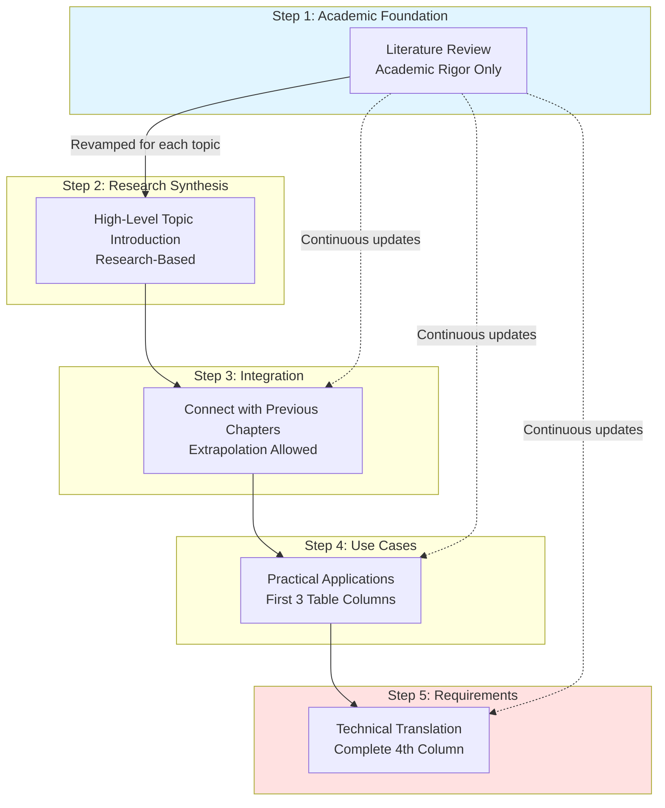

# Educational Context: Theory to Requirements

Translating evidence-based programming education use cases into requirements for program trace data & granular, semantic configurations.

> **Research Classification**: TCER Phases 1.B (domain-specific theories), 3.A (researcher synthesis), 3.B* (practitioner guidelines), 4.A* (infrastructure prototype)

- [Core Boundary Principle: _What Educational Developers Do_ vs. _How `embody` Enables Them_](#core-boundary-principle-what-educational-developers-do-vs-how-embody-enables-them)
- [Synthesis: Critical Use Cases and How Trace Data Enables Them](#synthesis-critical-use-cases-and-how-trace-data-enables-them)
- [Synthesis: Software Requirements](#synthesis-software-requirements)
  - [Trace Configuration](#trace-configuration)
  - [Trace Data \& Format](#trace-data--format)
- [Directory Organization](#directory-organization)
- [Methodology: _Translational CER Review Pipeline_](#methodology-translational-cer-review-pipeline)
  - [Overview](#overview)
  - [The 5-Step Translational Process](#the-5-step-translational-process)
    - [Step 1: Academic Literature Foundation](#step-1-academic-literature-foundation)
    - [Step 2: Initial Research-Based Synthesis](#step-2-initial-research-based-synthesis)
    - [Step 3: Integration \& Building on Previous Work](#step-3-integration--building-on-previous-work)
    - [Step 4: Use Cases \& Examples](#step-4-use-cases--examples)
    - [Step 5: Technical Requirements Translation](#step-5-technical-requirements-translation)
  - [Reproducibility Guidelines](#reproducibility-guidelines)

## Core Boundary Principle: _What Educational Developers Do_ vs. _How `embody` Enables Them_

**Our entire responsibility**: `embody(script, config) → trace`

- We provide raw execution traces of the JS callstack and granular, semantic-level trace configurations.
- Educational tool developers configure and consume our traces to implement all analysis, pedagogy, and student experiences.

Success is measured by how many different educational innovations can be built on our neutral foundation. We provide the execution data. Educational tools provide the intelligence. Together, they create learning experiences.

## Synthesis: Critical Use Cases and How Trace Data Enables Them

**Note**: This table shows ~35 representative critical use cases across all 12 categories. See [complete 77-use-case inventory with detailed trace requirements](./5-learning-tools-and-environments/use-cases-table.md) in the learning tools directory.

**Evidence Base Legend:**

- 🔬 **Established** - Direct research backing from literature review
- 📐 **Translated** - Established theory applied to trace/tool context
- 🧪 **Extension** - Derived from experience and/or extrapolating from research

### Category 1: Visualization & Mental Model Building

| **Use Case**                      | **Evidence** | **What Educational Tools Do**                                                                                                          | **How Trace Data Enables**                                                                                                                                                                                                                                                             |
| --------------------------------- | ------------ | -------------------------------------------------------------------------------------------------------------------------------------- | -------------------------------------------------------------------------------------------------------------------------------------------------------------------------------------------------------------------------------------------------------------------------------------- |
| Program execution visualization   | 🔬           | Render call stack, memory state, and variable values at each execution step to make invisible execution visible (Python Tutor, Jeliot) | **Events**: `function.call`, `function.return`, `variable.declare`, `variable.assign`, `variable.read`, `scope.create`. **Config**: `granularity: { variables: "all", functions: "user-code-only", scopes: "all" }`. Tools consume events → render execution steps.                    |
| Scope chain visualization         | 🔬           | Display nested scopes as visual hierarchy showing variable accessibility and closure relationships                                     | **Events**: `scope.create` with `parentScopeId`, `scope.enter`, `scope.exit`, `closure.capture`. **Config**: `granularity: { scopes: "all" }`. Tools consume scope events → render nested hierarchy.                                                                                   |
| Call stack animation              | 🔬           | Animate function calls and returns showing LIFO stack behavior with frames containing local variables and execution context            | **Events**: `function.call` with `newScopeId`, `function.return`. **Config**: `granularity: { functions: "user-code-only", scopes: "function-only" }`. Tools consume function events → render animated stack.                                                                          |
| Event loop visualization          | 📐           | Animate call stack, microtask queue, and macrotask queue separately showing async execution ordering (Loupe-style)                     | **Events**: `await.before`, `await.after`, `microtask.queue`, `microtask.execute`, `promise.create`, `promise.settle`. **Config**: `granularity: { async: "all", functions: "all" }`. Tools consume async events → render queues + stack separately.                                   |
| Closure visualization             | 📐           | Highlight captured variables showing scope persistence after outer function returns                                                    | **Events**: `closure.capture` with `capturedVariables[]`, `scope.exit`, `variable.read` with `resolvedScopeId` from outer scope. **Config**: `granularity: { scopes: "all", variables: "all" }`. Tools consume closure events → highlight captured vars persisting after outer return. |
| Temporal Dead Zone representation | 📐           | Show variables in TDZ as grayed-out or specially marked before initialization                                                          | **Events**: `variable.declare` with `inTDZ: true`, `variable.assign` with `wasInTDZ: true`, `variable.tdz-access` for access errors. **Config**: `granularity: { variables: "all" }`. Tools consume variable events → render TDZ variables differently.                                |

### Category 2: Debugging & Error Detection

| **Use Case**                            | **Evidence** | **What Educational Tools Do**                                                                                            | **How Trace Data Enables**                                                                                                                                                                                                                                             |
| --------------------------------------- | ------------ | ------------------------------------------------------------------------------------------------------------------------ | ---------------------------------------------------------------------------------------------------------------------------------------------------------------------------------------------------------------------------------------------------------------------- |
| Comprehension-first debugging           | 🔬           | Present buggy code for students to read, trace, debug, and fix before writing original programs (CodeWrite pedagogy)     | **Events**: All events for complete execution trace. **Config**: BEGINNER_VISUALIZATION preset. Tools provide stepping interface + state inspection using trace events.                                                                                                |
| Stepping debugger with state inspection | 🔬           | Enable step-through execution with variable inspection at each step for systematic bug localization                      | **Events**: All variable, function, scope events with `location`. **Config**: `granularity: { variables: "all", functions: "all", scopes: "all" }`. Tools implement step-forward/back using event sequence, display current state.                                     |
| Dynamic slicing for bug tracing         | 🔬           | Highlight code statements affecting specific error/value to show causality through execution (Agar, Whyline)             | **Events**: `variable.read`, `variable.assign`, `variable.update` tracking value flow. **Config**: `granularity: { variables: "all" }, filters: { variableNames: { include: [errorVariable] } }`. Tools analyze backward from error → highlight affecting statements.  |
| Error pattern recognition               | 📐           | Identify and categorize common bug patterns (off-by-one, null dereference, scope confusion, closure bugs) from execution | **Events**: `loop.iterate`, `error.throw`, `variable.read`, `closure.capture`. **Config**: `granularity: { controlFlow: "detailed", errors: "all", variables: "all" }`. Tools implement pattern detectors analyzing trace.                                             |
| Misconception-based bug detection       | 📐           | Detect bugs arising from specific misconceptions (hoisting confusion, coercion errors, reference bugs)                   | **Events**: `variable.tdz-access`, `expression.binary` with `coercionOccurred`, `variable.assign` with object IDs showing unintended sharing. **Config**: `granularity: { variables: "all", expressions: true }`. Tools detect patterns → classify misconception type. |

### Category 3: Assessment & Quality Evaluation

| **Use Case**                          | **Evidence** | **What Educational Tools Do**                                                                                     | **How Trace Data Enables**                                                                                                                                                                                                                                   |
| ------------------------------------- | ------------ | ----------------------------------------------------------------------------------------------------------------- | ------------------------------------------------------------------------------------------------------------------------------------------------------------------------------------------------------------------------------------------------------------ |
| Identifier naming assessment          | 🔬           | Evaluate variable/function names for descriptiveness and convention adherence (QLCs)                              | **Events**: `variable.declare` with `variableName`, `function.call` with `functionName`. **Config**: `granularity: { variables: "declarations-only", functions: "user-code-only" }`. Tools analyze names → assess quality.                                   |
| Algorithmic approach detection        | 🔬           | Identify iteration vs recursion, detect complexity patterns, recognize algorithm categories from execution (QLCs) | **Events**: `loop.enter`, `loop.iterate`, `function.call` (recursive calls). **Config**: `granularity: { controlFlow: "detailed", functions: "all" }`. Tools analyze → categorize algorithm (iterative, nested loops, recursive).                            |
| Design pattern recognition            | 📐           | Detect usage of accumulator, filter-map-reduce, observer, factory, and other patterns (QLCs)                      | **Events**: Variable update patterns, function call patterns, object creation patterns. **Config**: `granularity: { variables: "all", functions: "user-code-only", objects: "creation-only" }`. Tools implement pattern detectors analyzing event sequences. |
| Quality assessment beyond correctness | 🔬           | Evaluate code quality dimensions: naming, structure, design, maintainability (Ko 2019 QLCs framework)             | **Events**: Combination of variable, function, control flow events. **Config**: CODE_QUALITY_ASSESSMENT preset. Tools implement QLCs analyzing trace patterns → assess quality.                                                                              |
| Trace-based quality checking          | 🔬           | Analyze runtime execution patterns to assess code quality at scale (Lehtinen 2023 MOOCs)                          | **Events**: All relevant events for quality dimensions. **Config**: Performance-optimized with sampling for scale. Tools process thousands of traces → assess quality automatically (MOOC feasibility).                                                      |

### Category 4: Feedback & Guidance

| **Use Case**                        | **Evidence** | **What Educational Tools Do**                                                                                              | **How Trace Data Enables**                                                                                                                                                                                           |
| ----------------------------------- | ------------ | -------------------------------------------------------------------------------------------------------------------------- | -------------------------------------------------------------------------------------------------------------------------------------------------------------------------------------------------------------------- |
| Predictive feedback (POE)           | 📐           | Facilitate predict-observe-explain cycles where students predict behavior, execute, compare, and explain discrepancies     | **Events**: Complete execution trace for observation. **Config**: BEGINNER_VISUALIZATION. Tools compare student prediction to actual events → highlight discrepancies.                                               |
| Guided debugging hints              | 🔬           | Provide progressive hints from general to specific during debugging (Rivers & Koedinger 2017 data-driven hints)            | **Events**: Error context, variable states, control flow. **Config**: `granularity: { variables: "all", errors: "all" }`. Tools analyze trace → generate hints based on observed patterns.                           |
| Conversational AI tutoring          | 🔬           | Provide personalized natural language explanations and multi-turn Q&A for conceptual understanding (CodeHelp, CodeAid)     | **Events**: Full execution context for AI. **Config**: Configurable based on question. Tools send trace + question to AI → receive contextualized explanation.                                                       |
| Context-specific error explanations | 🔬           | Provide explanations tailored to specific error context rather than generic messages (Keuning 2018 feedback effectiveness) | **Events**: `error.context` with call stack, scope chain, variable states. **Config**: `granularity: { errors: "all" }, serialization: { values: "deep" }`. Tools use context to generate specific explanations.     |
| Misconception-targeted feedback     | 📐           | Detect misconception indicators and provide explanations correcting specific mental model errors                           | **Events**: Misconception-specific events (`tdz-access`, coercion flags, closure patterns). **Config**: `granularity: { variables: "all", expressions: true }`. Tools detect pattern → generate targeted correction. |

### Category 5: Misconception Detection & Correction

| **Use Case**                                | **Evidence** | **What Educational Tools Do**                                                                                           | **How Trace Data Enables**                                                                                                                                                                                      |
| ------------------------------------------- | ------------ | ----------------------------------------------------------------------------------------------------------------------- | --------------------------------------------------------------------------------------------------------------------------------------------------------------------------------------------------------------- |
| Scope misconception detection               | 📐           | Identify var usage in block-scoped contexts, variables used before declaration, scope confusion patterns                | **Events**: `variable.declare` with `kind: "var"` in block scopes, `scope.create` with `scopeType: "block"`. **Config**: `granularity: { variables: "all", scopes: "all" }`. Tools detect → flag misconception. |
| Type coercion misconception correction      | 📐           | Explain unexpected coercion in `==` comparisons, truthy/falsy confusions, implicit conversions                          | **Events**: `expression.binary` with `operator: "=="` and `coercionOccurred: true`. **Config**: `granularity: { expressions: true }`. Tools detect coercion → explain conversion.                               |
| Reference vs value misconception correction | 📐           | Show when assignment creates references not copies, explain mutation vs reassignment, demonstrate shared reference bugs | **Events**: `variable.assign` with same `objectId` to multiple variables. **Config**: `serialization: { circularRefs: "registry" }`. Tools detect shared references → explain vs copying.                       |
| Closure misconception detection             | 📐           | Identify classic closure bugs (loop with var), detect incorrect assumptions about variable capture                      | **Events**: `loop.enter` + `closure.capture` with `var` variables. **Config**: `granularity: { controlFlow: "detailed", scopes: "all" }`. Tools detect classic bug → explain scope capture.                     |
| Async misconception clarification           | 📐           | Explain event loop timing, clarify `await` behavior, show why `setTimeout(fn, 0)` isn't immediate                       | **Events**: `microtask.queue`, `await.before/after` showing ordering. **Config**: `granularity: { async: "all" }, output: { ordering: "async-aware" }`. Tools visualize ordering → explain event loop.          |

### Categories 6-12: Cross-Cutting Concerns

| **Use Case**                           | **Evidence** | **What Educational Tools Do**                                                                                            | **How Trace Data Enables**                                                                                                                                                                                                   |
| -------------------------------------- | ------------ | ------------------------------------------------------------------------------------------------------------------------ | ---------------------------------------------------------------------------------------------------------------------------------------------------------------------------------------------------------------------------- |
| Pedagogical approach adaptation        | 📐           | Support diverse teaching methods: visualization-first, comprehension-first, assessment-driven, AI-tutored                | **Events**: Flexible based on approach. **Config**: Adaptive presets (BEGINNER_VISUALIZATION, CODE_QUALITY_ASSESSMENT, COMPREHENSIVE_DEBUGGING). Tools implement approach-specific analysis using appropriate event subsets. |
| Learning objective alignment           | 📐           | Support varied learning goals: mental models, debugging skills, code quality, specific concepts (closures, async, etc.)  | **Events**: Objective-specific (mental models→scope/function events, quality→QLCs events, concepts→NM-specific events). **Config**: Granularity matched to objective. Tools filter/aggregate events based on learning goal.  |
| Millisecond feedback loops             | 🔬           | Provide immediate output feedback in live coding environments and REPLs for fast experimentation                         | **Events**: Minimal - execution completion. **Config**: `performance: { streaming: true }`. Tools show output immediately with minimal trace overhead.                                                                       |
| Multi-tool integration                 | 📐           | Enable multiple educational tools to consume same trace for consistent, integrated student experience                    | **Events**: Same trace shared across tools. **Config**: Single `embody(code, config)` call. Tools (visualization + assessment + AI tutor) all consume same events → implement own pedagogies.                                |
| MOOC-scale deployment                  | 🔬           | Support thousands of concurrent students with acceptable performance (Lehtinen 2023 trace-based QLCs at scale)           | **Events**: Sampled events. **Config**: `performance: { sampling: { enabled: true, rate: 5 }, maxEvents: 50000 }`. Tools process reduced traces maintaining quality assessment capability.                                   |
| Progressive disclosure via granularity | 📐           | Scaffold learning by revealing execution detail progressively as student knowledge grows                                 | **Events**: Same schema, variable detail. **Config**: Beginner→`{ expressions: false }`, Advanced→`{ expressions: true }`. Tools adjust granularity over time without changing analysis logic.                               |
| Execution granularity progression      | 📐           | Increase trace detail from macro (program-level) to meso (statement-level) to micro (expression-level) across curriculum | **Events**: Macro→function/scope, Meso→variables/control flow, Micro→expressions. **Config**: Progression: `{ controlFlow: "basic" }` → `"detailed"` → `{ expressions: true }`. Tools use same trace format across levels.   |
| Notional machine progression           | 📐           | Sequence NM complexity from basic execution model through advanced concepts (scope → closures → async → prototypes)      | **Events**: NM-specific event subsets. **Config**: Basic→variables/functions, Intermediate→scopes/closures, Advanced→async/prototypes. Tools enable concepts progressively via event filtering.                              |
| Objective-based tool selection         | 📐           | Match configuration presets to learning objectives for optimal trace granularity and performance                         | **Events**: Preset-determined. **Config**: Mental models→BEGINNER_VISUALIZATION, Debugging→COMPREHENSIVE_DEBUGGING, Quality→CODE_QUALITY_ASSESSMENT. Tools select preset matching objective.                                 |
| Student-level adaptation               | 📐           | Adjust trace detail and performance based on student proficiency level                                                   | **Events**: Adaptive. **Config**: Novice→basic granularity + excluded built-ins, Expert→detailed granularity + all functions. Tools adapt config based on student assessment.                                                |

## Synthesis: Software Requirements

Phase 5 translation of all 77 educational use cases reveals comprehensive requirements for `embody(script, config) → trace`. The specifications maintain strict boundary compliance: embody provides neutral trace infrastructure, educational tools implement pedagogy.

**Key Achievement**: Evidence-based educational JavaScript tracer fully specified with 30+ event types, complete configuration API, and use case validation.

**Complete Technical Specifications**: See [`/5-learning-tools-and-environments/`](./5-learning-tools-and-environments/) for:

- [Trace Event Schemas](./5-learning-tools-and-environments/trace-event-schemas.md) (~850 lines, 30+ event types with TypeScript interfaces)
- [Trace Configuration API](./5-learning-tools-and-environments/trace-configuration.md) (~680 lines, complete config specification with presets)
- [Use Cases with Trace Requirements](./5-learning-tools-and-environments/use-cases-table.md) (77 use cases, all with detailed trace requirements)
- [Phase 5 Summary](./5-learning-tools-and-environments/PHASE5-SUMMARY.md) (comprehensive achievement overview, implementation priorities)
- [Phase 5 Quality Review](./5-learning-tools-and-environments/PHASE5-QUALITY-REVIEW.md) (boundary compliance verification, 95/100 quality score)

### Trace Configuration

**Purpose**: Control trace generation granularity, filtering, performance, and output format to match educational use cases while maintaining neutral infrastructure boundary.

**Configuration Categories** (see [full specification](./5-learning-tools-and-environments/trace-configuration.md)):

**1. Granularity Control** - Adjust detail level per execution aspect:

- **Variables**: `all | declarations-only | writes-only | none`
  - `all`: Track declare, assign, read, update, TDZ access
  - `declarations-only`: Only variable declarations (naming assessment)
  - `writes-only`: Declarations + assignments/updates (value flow, no read tracking)
- **Functions**: `all | user-code-only | none`
  - `all`: Track all functions including built-ins (API usage analysis)
  - `user-code-only`: Only student code (exclude Array.map, console.log, etc.)
- **Scopes**: `all | function-only | none`
  - `all`: Functions + blocks (complete scope chain, closure visualization)
  - `function-only`: Function scopes only (simpler mental model)
- **Control Flow**: `detailed | basic | none`
  - `detailed`: All branches, loop iterations (algorithm detection, complexity analysis)
  - `basic`: Loop enter/exit only (simplified execution tracking)
- **Async**: `all | await-only | none`
  - `all`: Promises, microtasks, await (event loop visualization, async misconceptions)
  - `await-only`: Just await points (basic async tracking)
- **Objects**: `all | creation-only | none`
  - `all`: Create, property access, prototype lookup (reference visualization, OOP concepts)
  - `creation-only`: Just object creation (memory allocation tracking)
- **Errors**: `all | throws-only | none`
  - `all`: Throw, catch, context (complete error flow, debugging)
  - `throws-only`: Just throw events (error detection without handling details)
- **Expressions**: `true | false` (default: `false`)
  - `true`: Binary and unary operations (type coercion detection, evaluation order - HIGH OVERHEAD)
  - `false`: Skip micro-level expression tracking (performance-friendly)

**2. Filtering** - Reduce trace size via selective capture:

- **Variable names**: `include: string[] | exclude: string[] | pattern: RegExp`
  - Focus on specific variables (watchpoints, targeted debugging)
- **Function names**: `include | exclude | pattern`
  - Filter by function identity (exclude test frameworks, include student code)
- **Scope types**: `(global | function | block | catch)[]`
  - Control which scope levels are traced
- **Source locations**: `includeFiles | excludeFiles | lineRange: {start, end}`
  - Trace specific code sections (breakpoints, module-specific analysis)
- **Built-in exclusion**: `excludeBuiltins: boolean`
  - Common filter to remove Array.prototype methods, Object methods, etc.

**3. Performance Tuning** - Balance pedagogical value vs overhead:

- **Max events**: Hard limit to prevent memory exhaustion
- **Sampling**: `{enabled: boolean, rate: number, strategy: "random" | "systematic"}`
  - MOOC scale: Sample 1 in 5-10 events while maintaining quality assessment capability
- **Streaming**: `true | false`
  - Stream events as generated vs buffer all (real-time visualization vs complete traces)
- **Memory limits**: Estimated trace size caps

**4. Serialization Control** - Configure value representation:

- **Values**: `none | shallow | deep`
  - `shallow`: Type + top-level value, object IDs (reference tracking, performance-friendly)
  - `deep`: Full object properties (state inspection, comprehensive debugging)
- **Object properties**: `all | own-only | none`
  - Controls property enumeration depth
- **Function source**: `true | false`
  - Include function body text (can be large, useful for dynamic code analysis)
- **Circular references**: `mark | omit | registry`
  - Registry pattern prevents infinite loops while enabling complete object graphs
- **Max depth**: Integer limit for recursive serialization

**5. Output Format**:

- **Formats**: `json | ndjson | binary`
  - JSON: Single object, complete trace (easy parsing, high memory)
  - NDJSON: Newline-delimited events (streaming-friendly, lower memory)
  - Binary: Compact encoding (smallest size, requires decoder)
- **Ordering**: `sequential | async-aware`
  - `sequential`: Chronological for synchronous code
  - `async-aware`: Global sequenceId ordering across async boundaries (critical for event loop visualization)
- **Metadata**: Include source, config, timing information
- **Summary**: Event counts, performance metrics

**Configuration Presets** (see [trace-configuration.md](./5-learning-tools-and-environments/trace-configuration.md#6-preset-configurations)):

- **BEGINNER_VISUALIZATION**: User code only, function-level scopes, basic control flow, shallow serialization, no async/expressions
- **COMPREHENSIVE_DEBUGGING**: All events, deep serialization, detailed control flow, async tracking, expression-level detail
- **CODE_QUALITY_ASSESSMENT**: Declarations-only variables, user functions, detailed control flow, shallow values (naming + structure analysis)
- **PERFORMANCE_SAMPLING**: Reduced granularity, systematic sampling, NDJSON streaming (MOOC scale)

**Key Pattern**: Same event schema, progressive revealing via configuration enables pedagogical scaffolding without encoding educational opinions. Tools select config matching use case, embody honors request neutrally.

### Trace Data & Format

**Event Categories** (see [full schemas](./5-learning-tools-and-environments/trace-event-schemas.md)):

1. **Variable Events** (5 types): `declare`, `assign`, `read`, `update`, `tdz-access`
   - Enable: Scope visualization, value flow tracking, TDZ detection, closure analysis, naming assessment
   - Key fields: `variableName`, `kind` (let/const/var), `value`, `inTDZ`, `resolvedScopeId` (for closures)

2. **Function Events** (3 types): `call`, `return`, `throw`
   - Enable: Call stack visualization, this binding tracking, argument evaluation, recursion detection
   - Key fields: `functionName`, `callType` (direct/method/constructor), `thisValue`, `arguments[]`, `returnValue`

3. **Scope Events** (4 types): `create`, `enter`, `exit`, `closure.capture`
   - Enable: Scope chain visualization, lexical scoping explanation, closure detection
   - Key fields: `scopeId`, `parentScopeId` (forms tree), `scopeType`, `capturedVariables[]`

4. **Control Flow Events** (4 types): `conditional.branch`, `loop.enter`, `loop.iterate`, `loop.exit`
   - Enable: Branch coverage, algorithm detection, iteration counting, complexity analysis
   - Key fields: `conditionValue`, `branchTaken`, `iterationNumber`, `exitReason`

5. **Async Events** (6 types): `await.before`, `await.after`, `promise.create`, `promise.settle`, `microtask.queue`, `microtask.execute`
   - Enable: Event loop visualization, async timing explanation, microtask/macrotask ordering
   - Key fields: `promiseId`, `state` (fulfilled/rejected), `taskType`, queue ordering

6. **Object Events** (3 types): `create`, `property.access`, `prototype.lookup`
   - Enable: Reference visualization, prototype chain, delegation explanation, memory model
   - Key fields: `objectId` (unique reference), `prototype`, `properties{}`, `lookupChain[]`

7. **Error Events** (3 types): `throw`, `catch`, `context`
   - Enable: Error flow visualization, debugging context, exception handling analysis
   - Key fields: `error`, `errorType`, `message`, `callStack[]`, `scopeChain[]`

8. **Expression Events** (2 types): `binary`, `unary` - **optional, high overhead**
   - Enable: Type coercion detection, evaluation order visualization, operator analysis
   - Key fields: `operator`, `left`, `right`, `result`, `coercionOccurred`

9. **Value Serialization**: Primitive, Object, Function, Special value types
   - Primitives: Direct values (number, string, boolean, null, undefined, bigint, symbol)
   - Objects: Unique `objectId`, constructor name, properties (if configured), circular reference handling
   - Functions: `functionId`, name, source location, optional source code
   - Special: Explicit markers for TDZ, uninitialized, NaN, ±Infinity

**Total**: 30+ distinct event types covering all 77 educational use cases.

**Core Event Structure** (all events share):

```typescript
{
  type: string; // Event identifier (e.g., "variable.declare")
  timestamp: number; // High-resolution time (performance.now())
  sequenceId: number; // Global ordering (critical for async)
  location: SourceLocation; // Code position {line, column, source}
  // ... event-specific fields
}
```

**Trace Object Format**:

```typescript
{
  metadata: {
    source: string;              // Code being traced
    config: EmbodyConfig;        // Configuration used
    startTime: number;
    endTime: number;
  },
  events: TraceEvent[];          // Ordered by sequenceId
  summary: {
    totalEvents: number;
    eventCounts: Record<string, number>; // Counts per event type
    // ... performance metrics
  }
}
```

**Key Guarantees**:

- **Sequential code**: Events ordered chronologically as executed
- **Async code**: `sequenceId` provides global ordering across async boundaries (event loop correctness)
- **Scope hierarchy**: `parentScopeId` fields form tree structure
- **Call stack**: Function call/return events nest properly (LIFO guarantee)
- **Circular references**: Registry pattern prevents infinite loops in object graphs
- **Object identity**: Unique IDs (`objectId`, `functionId`, `scopeId`) enable reference tracking without modifying traced objects

**Implementation Priorities** (based on use case analysis, see [PHASE5-SUMMARY.md](./5-learning-tools-and-environments/PHASE5-SUMMARY.md#implementation-priorities-for-embody)):

- **Tier 1 (Essential - 80% use case coverage)**: Variable (declare/assign/read), Function (call/return), Scope (create/enter/exit), Error events
  - Enables: Basic visualization, debugging, quality assessment
  - Priority: Implement first for maximum educational value

- **Tier 2 (Important - 50% additional coverage)**: Control flow, Variable update, Object create, Closure capture
  - Enables: Advanced mental models, misconception detection, algorithm analysis

- **Tier 3 (Advanced - 30% specialized coverage)**: Async events, Prototype lookup, Property access, TDZ access
  - Enables: Advanced concepts (async, OOP), specific misconceptions

- **Tier 4 (Optional - specialized use)**: Expression events (binary, unary)
  - Enables: Micro-level analysis, type coercion detection
  - Default: Disabled due to high overhead (advice function called for every operation)

**Boundary Compliance**: All specifications describe data structures and configuration options only. Zero pedagogical interpretation. Educational tools consume traces and implement all analysis algorithms, visualization strategies, assessment logic, feedback generation, and student interaction patterns. Embody provides neutral infrastructure, tools provide intelligence.

## Phase Completion Status

| Directory                             | Phases Complete | Status        | Key Deliverables                                                                                 |
| ------------------------------------- | --------------- | ------------- | ------------------------------------------------------------------------------------------------ |
| `/0-literature-review/`               | 1               | ✅ Continuous | Academic foundation, comprehensive bibliography, continuously updated                            |
| `/1-taxonomies/`                      | 1-5             | ✅ Complete   | SOLO, Block Model, BSI, Abstraction framework correlations with trace requirements               |
| `/2-misconceptions/`                  | 1-5             | ✅ Complete   | Misconception catalog, detection patterns, trace-based correction strategies                     |
| `/3-threshold-concepts/`              | 1-5             | ✅ Complete   | Portal moments, liminal states, threshold barriers with trace specifications                     |
| `/4-notional-machines/`               | 1-5             | ✅ Complete   | NM typology, validation strategies, mental model trace requirements                              |
| `/5-learning-tools-and-environments/` | 1-5             | ✅ Complete   | **77 use cases, 30+ event types, complete configuration API, Phase 5 quality-reviewed (95/100)** |
| `/6-assessment-strategies/`           | -               | 📋 Planned    | Quality-Level Characteristics, assessment approaches _(future iteration)_                        |

**Legend**: ✅ Complete | 🔄 In Progress | 📋 Planned

**Current Achievement**: All foundational directories (0-5) complete with comprehensive trace requirements. Phase 5 (Technical Requirements Translation) completed for directory 5 with 77 use cases mapped to trace events and configurations. Assessment strategies directory (6) planned as next iteration.

## Directory Organization

Each directory builds on the findings of previous ones through the snowball approach:

1. **[`/0-literature-review/`](./0-literature-review/README.md)** (Phase 3.A) - Continuously updated academic foundation for all topics
2. **[`/1-taxonomies/`](./1-taxonomies/README.md)** (Phase 3.B\*) - Educational frameworks (SOLO, Block Model, BSI, Abstraction Transition) translated to trace requirements
3. **[`/2-misconceptions/`](./2-misconceptions/README.md)** (Phase 1.B) - JavaScript error patterns and detection strategies
4. **[`/3-threshold-concepts/`](./3-threshold-concepts/README.md)** (Phase 1.A\*) - Transformative learning barriers and portal moments
5. **[`/4-notional-machines/`](./4-notional-machines/README.md)** (Phase 1.B) - Mental model support and validation approaches
6. **[`/5-learning-tools-and-environments/`](./5-learning-tools-and-environments/README.md)** (Phases 1-5 ✅) - Educational tool use cases with complete trace requirements (77 use cases, 30+ event types, full configuration API)
7. **[`/6-assessment-strategies/`](./6-assessment-strategies/README.md)** (Phase 3.B\*) - Evaluation and assessment approaches _(planned)_

## Methodology: _Translational CER Review Pipeline_

### Overview

We populated this directory through a **systematic snowball approach**: each subdirectory builds on the findings of all previous ones, creating cumulative knowledge that progressively translates Computing Education Research into technical requirements.

The methodology follows a **5-step process** (TS Stage 2) that systematically translates academic research through problem-space understanding into technical specifications. The literature review (`/0-literature-review/`) is continuously revamped with each topic iteration, ensuring all work remains grounded in current research.



**Translational Sprint context**: This 5-step process operationalizes TS Stage 2 (Design Alternatives) through systematic, cyclical refinement. Each subdirectory represents an iteration that may require returns to previous steps. See [/embodying-tcer/8-agile-cer-connection/](../embodying-tcer/8-agile-cer-connection/) for complete sprint mapping.

### The 5-Step Translational Process

Each subdirectory (taxonomies, misconceptions, threshold concepts, notional machines, etc.) follows this systematic process to ensure reproducibility and academic rigor.

---

#### Step 1: Academic Literature Foundation

**Location**: `/0-literature-review/`

**Process**:

1. Deep re-reading of existing literature review for context before starting on the next folder.
2. Comprehensive literature search:
   - Google Scholar queries with forward/backward citation following
   - Domain-specific sources (e.g., `notionalmachines.github.io`, ACM Digital Library, IEEE Xplore)
   - Cross-reference analysis across multiple publications
3. Continuous note-taking documenting understandings and learnings
4. Critical analysis of methodology and findings quality

**Deliverables**:

- New markdown files in `/0-literature-review/` as needed for topic areas
- Citations added to `comprehensive-bibliography.md` with full metadata
- Integration of findings into `/0-literature-review/README.md`
- Topic-specific literature review files when warranted

**CRITICAL ACADEMIC STANDARD**:

> **All documentation MUST BE rigorous summaries of and connections between academic publications ONLY.**
>
> - ✅ Direct summaries of research findings with citations
> - ✅ Connections between multiple academic sources
> - ✅ Research gaps explicitly identified in literature
> - ✅ Methodology descriptions from published papers
> - ✅ Conflicting findings noted without resolution attempts
> - ❌ Author speculation or extrapolation beyond sources
> - ❌ Convenient citations selected to support desired narrative
> - ❌ Non-academic sources (blogs, tutorials, documentation)
> - ❌ Filling gaps with "logical" assumptions
>
> **Even if it breaks narrative flow, creates inconsistencies, or leaves findings incomplete** - this is the research-backed foundation for all subsequent work.

**Content Quality Markers**:

- Multiple citations per major claim
- Direct quotes from seminal papers
- Explicit acknowledgment of research limitations
- Clear separation of established vs. emerging findings
- Transparent methodology documentation

---

#### Step 2: Initial Research-Based Synthesis

**Location**: Target subdirectory's README (e.g., `/4-notional-machines/README.md`)

**Process**:

1. Synthesize Step 1 findings into high-level topic introduction
2. Define key concepts and terminology from research
3. Establish scope and boundaries based on literature
4. Provide research-based context for readers new to the topic

**Deliverables**:

- Initial README sections with topic overview
- Definitions grounded in academic sources
- Scope statement based on research coverage
- Foundation for subsequent steps

**Content Guidelines**:

- Start with research-based definitions and framing
- Can add practical framing for accessibility
- Maintain clear citations to Step 1 literature
- Set expectations for what follows in later steps

**Example Structure**:

```markdown
# Notional Machines

## What Research Says

[Synthesis from Phase 1 academic sources]

## Key Concepts

[Definitions from literature]

## Scope

[Based on research coverage and gaps]
```

---

#### Step 3: Integration & Building on Previous Work

**Location**: Target subdirectory documents

**Process**:

1. Review ALL previous subdirectories for connection points
2. Identify how current topic relates to:
   - Educational taxonomies (SOLO, Block Model, BSI, Abstraction Transition)
   - JavaScript misconceptions catalog
   - Threshold concepts and liminal states
   - Previous topics' findings
3. Build correlations, extensions, and syntheses
4. Flesh out topic with extrapolation and imagination for our specific use case
5. Create categorizations and frameworks

**Deliverables**:

- Correlation documents (e.g., "How NMs address misconceptions")
- Integration matrices connecting topics
- Categorization schemes (by use, granularity, abstraction level, etc.)
- Topic-specific frameworks building on previous work
- Multiple documents serving different analytical purposes

**Content Guidelines** (relaxed from Phase 1):

- ✅ Extrapolation and synthesis beyond direct citations
- ✅ Author's analysis and categorization frameworks
- ✅ Connections not explicitly made in literature
- ✅ Practical examples and applications
- ✅ Non-academic sources where relevant (tools, frameworks)
- ⚠️ Must clearly distinguish research-backed vs. author's synthesis
- ❌ Still no "How Trace Data Enables" - that's Phase 5

**Example Deliverables**:

- `notional-machines-misconception-correlation.md`
- `categorization-by-abstraction-level.md`
- `language-comparison-analysis.md`
- `online-vs-offline-notional-machines.md`

---

#### Step 4: Use Cases & Examples

**Location**: Target subdirectory documents + begin use case table

**Process**:

1. Inventory practical applications based on Phases 1-3
2. Create multiple document types:
   - Introductions for newcomers to the concept
   - Language/domain-specific comparisons
   - Categorizations by various dimensions
   - Practical examples and scenarios
3. BEGIN the use case table (first 3 columns only):
   - **Use Case name**: Descriptive identifier
   - **Evidence basis**: 🔬 Established / 📐 Framework / 🧪 Extrapolation
   - **What Educational Tools Do**: The pedagogical/analytical function

**Deliverables**:

- Comprehensive use case inventory
- Multiple categorization schemes
- Practical application examples
- Partial use case table (3 columns)
- Integration with previous chapters' use cases

**Content Guidelines**:

- Focus on WHAT educational tools need to accomplish
- Document various abstraction levels and use contexts
- Connect use cases to research findings and previous chapters
- DO NOT YET specify trace data requirements
- Can be creative and imaginative about applications

**Critical Boundary**:
At this step, think about educational goals and tool capabilities, NOT about how trace data will enable them. That separation comes in Step 5.

---

#### Step 5: Technical Requirements Translation

**Location**: Complete subdirectory README + technical specifications

**Process**:

1. For each use case from Phase 4, determine trace data needs
2. Complete the 4th column: **How Trace Data Enables**
3. Create code snippets illustrating:
   - Required trace event types
   - Configuration options
   - Example trace output structures
   - Data format specifications
4. Write technical specifications maintaining strict boundary

**Deliverables**:

- Complete 4-column use case table
- Code snippets (kept separate from table for readability)
- Configuration specification documents
- Data format requirements
- Performance considerations
- Integration with main README synthesis

**Content Guidelines**:

- ✅ Specific trace event types needed (e.g., "scope creation/capture events")
- ✅ Configuration granularity options (e.g., "configurable loop iteration tracking")
- ✅ Data structure specifications (e.g., "function call/return events with context")
- ✅ Performance and scalability considerations
- ❌ Educational interpretation of trace data (that's "What They Do")
- ❌ Pedagogical strategies or frameworks (that's "What They Do")
- ❌ UI/visualization implementation details (that's "What They Do")
- ❌ Assessment algorithms or logic (that's "What They Do")

**The Critical Boundary**:

Remember: `embody(script, config) → trace`

- **We provide**: Raw execution events, configurable granularity, structured data format
- **They implement**: Analysis algorithms, pedagogical interpretation, student interfaces, assessment logic

**Example Requirements**:

```javascript
// Notional machine validation use case
{
  // What educational tools need:
  // "Verify student mental models against actual execution"

  // How trace data enables it:
  // Complete execution state at each step
  config: {
    variables: { declare: true, assign: true, read: true },
    controlFlow: { loops: true, conditionals: true },
    functions: { calls: true, returns: true }
  }
  // → Tool receives step-by-step state snapshots
  // → Tool compares to student's predicted states
  // → Tool implements the pedagogy
}
```

---

### Reproducibility Guidelines

To apply this methodology to a new Computing Education Research topic:

**Before Starting**:

- [ ] Identify the research domain and key terminology
- [ ] Locate primary academic sources and repositories
- [ ] Review previous subdirectories for integration points
- [ ] Understand the boundary: neutral infrastructure vs. educational intelligence

**Phase Checkpoints**:

- [ ] Phase 1: All claims have academic citations, no speculation added
- [ ] Phase 2: Topic introduced clearly with research grounding
- [ ] Phase 3: Connections made with ALL previous subdirectories
- [ ] Phase 4: Use cases documented WITHOUT trace requirements yet
- [ ] Phase 5: Requirements specify ONLY "How Trace Enables", not "What Tools Do"

**Quality Validation**:

- Does Phase 1 content survive hostile academic peer review?
- Can someone unfamiliar with the topic understand Phase 2?
- Do Phase 3 correlations reveal new insights or contradictions?
- Are Phase 4 use cases practical and grounded in real needs?
- Do Phase 5 requirements maintain strict infrastructure boundary?

**Common Pitfalls to Avoid**:

- Adding speculation to Phase 1 to "fill gaps" in research
- Jumping to technical solutions before understanding problem space
- Confusing "what educational tools do" with "how we enable them"
- Creating use cases that imply specific pedagogical approaches
- Specifying trace requirements that encode educational interpretations

**Documentation Standards**:

- Document exact search terms and databases used for reproducibility
- Maintain full citations with DOI when available
- Explain reasoning for grouping and categorizing findings
- Clearly mark when adaptation or interpretation is required beyond sources
